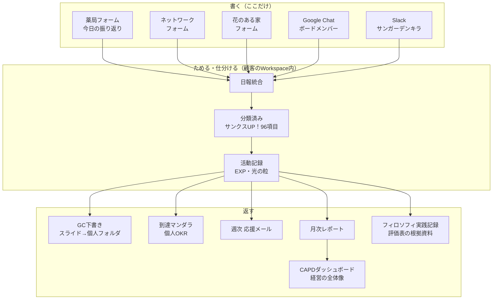
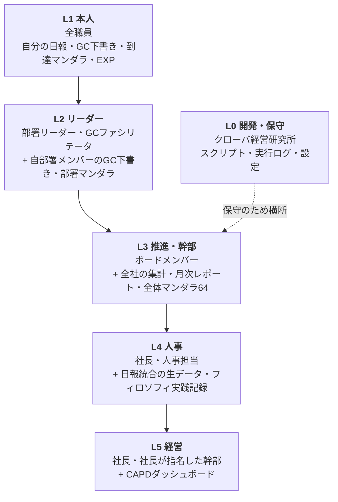
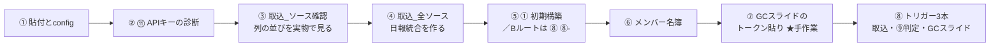
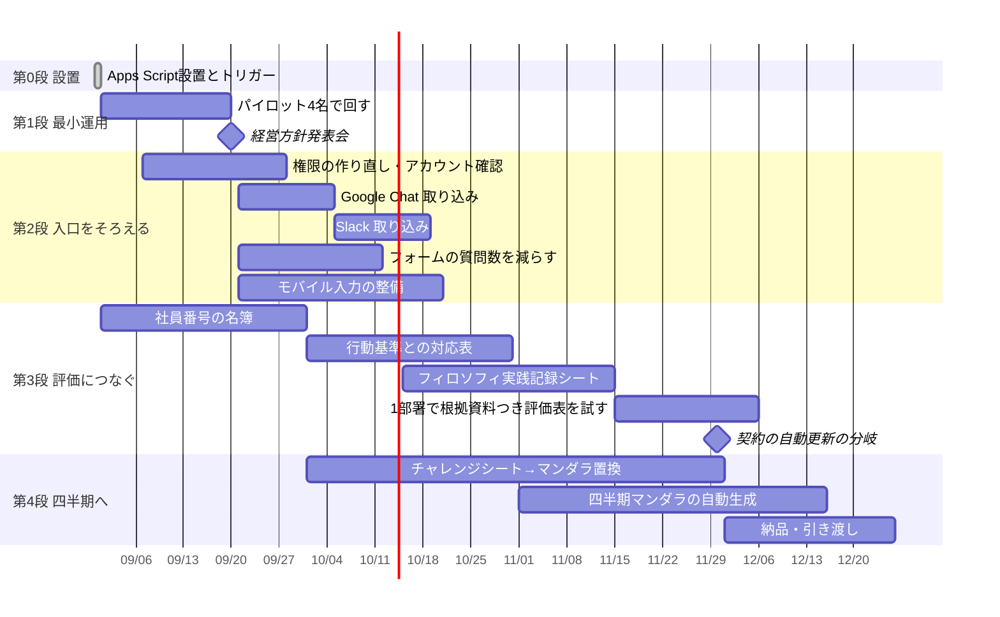

# 全体設計図 ── 誰がどこから入るか、何をどの順で作るか

作成 2026-08-29
対象 MCQ113 有限会社髙村（SUNグループ）日報解析システム／ブルーミングクエスト

この文書が答えるのは3つ。

1. **入口はいくつあり、誰がどこから入るのか**（権限の層）
2. **9月1日に成立させる範囲はどこまでか**
3. **9月1日のあと、12月末までに何をどの順で作るか**

---

# 第1部　全体の絵

## 1-1. ひとことで言うと

**書くのは日報の1か所だけ。あとは全部そこから降りてくる。**



⚠ **EXP（光の粒）は GC下書き・チャレンジシート・評価の材料には出さない。**
日々の励みのためだけに使う。内省の場と評価の場に点数を持ち込まない（CLAUDE.md 禁じ手2）。

## 1-2. 3層のマンダラと、日報の位置

```
経営理念・フィロソフィ51
      ↓
   経営計画（3ヶ月ごとに置き直す）
      ↓ 降ろす
全体マンダラ64 ／ 部署マンダラ ／ 個人マンダラ（OKR）
      ↑ 光の粒が積み上がる      ↑ 毎週の中身＝GCシート
             日報（書くのはここだけ）
```

個人マンダラOKRの毎週の中身は、すでに動いている**週次GCシートが担う。新しい記入シートは作らない。**

---

# 第2部　権限の設計

## 2-1. 考え方の順序

権限は「役職」ではなく **「その人が責任を負う範囲」** で切る。3つの原則で決めた。

| 原則 | 意味 |
|---|---|
| **自分のものは自分が見る** | 日報・GC下書き・到達マンダラ・EXPは、本人が第一の読み手 |
| **束ねた瞬間に一段上がる** | 個人1人分は本人のもの。複数人分を横に並べた時点で、それは経営の資料 |
| **評価に効くものは最上位** | 評価表の根拠資料は、人事の判断に直結する。ここだけは別扱い |

## 2-2. 権限の層（L0〜L5）



**上の層は下の層をすべて含む。** ただし L0 だけは別系統。人事判断には関与しない。

## 2-3. 誰がどこから入るか（入口の一覧）

| 層 | 誰 | 入口 | 見えるもの | 認証のしかた |
|---|---|---|---|---|
| **L1** | 全職員 | 既存の日報フォーム（スマホ可） | 自分が書いたもの | フォームは記名式。認証なしでも可 |
| **L1** | 全職員 | Googleドライブの**個人フォルダ** | 自分のGC下書きスライドだけ | 本人のGoogleアカウントに個別共有 |
| **L1** | 全職員 | **週次応援メール**（金16:00） | 自分のEXPと今週の一言 | 本人宛メール |
| **L1** | 全職員 | 到達マンダラ Webアプリ | **自分の**マンダラ | ⚠ 2-5参照。作り直しが要る |
| **L2** | 部署リーダー | 部署フォルダ | 自部署メンバーのGC下書き | 部署フォルダをリーダーに共有 |
| **L2** | 部署リーダー | 部署マンダラ | 自部署の集計 | 同上 |
| **L3** | 推進メンバー | 推進メンバーポータル<br/>https://myhou.co.jp/portal/takamura/ | 運用マニュアル・手順・進捗 | Basic認証 |
| **L3** | 幹部 | メインSS「SUN日報解析」 | 集計シート・実行ログ・全体マンダラ64 | Workspaceの共有設定（閲覧） |
| **L3** | 幹部 | 月次レポート（毎月1日 7:00） | 全社の月次サマリ | メール配信 |
| **L4** | 社長・人事 | **別スプレッドシート**（新設） | 日報統合の生データ／フィロソフィ実践記録 | 限定共有。L3には出さない |
| **L5** | 社長 | CAPDダッシュボード<br/>https://myhou.co.jp/CAPD/SUN-Group/ | 経営の全体像 | Basic認証（ID takamura） |
| **L0** | クローバ | Apps Script エディタ | 全部 | Workspaceの編集権限 |

## 2-4. データごとの見える範囲（早見表）

| データ | L1本人 | L2リーダー | L3幹部 | L4人事 | L5経営 |
|---|:---:|:---:|:---:|:---:|:---:|
| 自分の日報 | ⭕ | — | — | ⭕ | ⭕ |
| 他人の日報の生データ | ❌ | ❌ | ❌ | ⭕ | ⭕ |
| 自分のGC下書き | ⭕ | — | — | — | — |
| 自部署のGC下書き | — | ⭕ | ❌ | ❌ | ❌ |
| 自分のEXP・光の粒 | ⭕ | — | — | — | — |
| 他人のEXP | ❌ | ❌ | ❌ | ❌ | ❌ |
| 自分の到達マンダラ | ⭕ | — | — | — | — |
| 部署マンダラ | ⭕閲覧 | ⭕ | ⭕ | ⭕ | ⭕ |
| 全体マンダラ64 | ⭕閲覧 | ⭕ | ⭕ | ⭕ | ⭕ |
| 月次レポート | ❌ | ❌ | ⭕ | ⭕ | ⭕ |
| フィロソフィ実践記録 | ❌ | ❌ | ❌ | ⭕ | ⭕ |
| CAPDダッシュボード | ❌ | ❌ | ❌ | ❌ | ⭕ |

⭐ **EXPは他人のものが見えない。** ランキングを作らない。
比較が始まると日報が点数稼ぎに歪む。これは設計の線であって設定の都合ではない。

⭐ **GC下書きは横に並べない。** リーダーが見るのは自部署ぶんだけ。
全社ぶんを一覧できる画面は作らない。

## 2-5. ⚠ いまの実装と、この設計のずれ

**到達マンダラの Web アプリだけ、上の設計になっていない。**

`gas/appsscript.json` は現在こうなっている。

```
"executeAs": "USER_DEPLOYING",
"access": "ANYONE_ANONYMOUS"
```

`gas/コード.gs` の `doGet` は、共有トークン `?key=` が合っているかだけを見る。

```javascript
if (p.key !== SECRET_CONFIG.APP_TOKEN) { /* 拒否 */ }
var mem = String(p.member || '').trim();
return mem ? tkOkrMandalaHtml_(mem) : tkOkrIndexHtml_(p.key);
```

つまり **トークンを1つ知っていれば、`?member=` を書き替えるだけで誰の到達マンダラでも開ける。**
社内に配るURLが1本なので、配った時点で全員が全員のものを見られる。

これは 2-4 の「他人の到達マンダラは見えない」と噛み合わない。

### 直しかた

| | いま | 変更後 |
|---|---|---|
| `access` | `ANYONE_ANONYMOUS` | `DOMAIN`（takamura-sunsun.com のみ） |
| `executeAs` | `USER_DEPLOYING` | `USER_ACCESSING` |
| 本人の特定 | `?member=` を信じる | `Session.getActiveUser().getEmail()` で見る |
| 他人を見る | 誰でも見られる | メンバー表の「上長」欄に一致する場合だけ |

**引き換えに起きること**：会社のGoogleアカウントでログインしていないと開けなくなる。
青木さまが挙げられた「全員がPCを持っていない／スマホから入る」という状況と直結する。
**アカウントの配布状況を確認してから切り替える。** 9月中に着手し、10月の範囲拡大に合わせる。

それまでの当座の扱いは 3-3 に書く。

---

# 第3部　9月1日に成立させる範囲

## 3-1. 期日の現実

| 日付 | 曜日 | 何がある |
|---|---|---|
| 2026-08-29 | 土 | 今日 |
| 2026-08-31 | 月 | **設置に使える営業日はこの1日** |
| 2026-09-01 | 火 | 運用開始（8/28会議の決定） |
| 2026-09-04 | 金 | **最初のGC下書きが出る日** |
| 2026-09-20 | 日 | 経営方針発表会 |
| 2026-09-25 | 金 | 次回 AI×DXミーティング 13:00-14:00 |

⭐ **9/1に間に合わせる作業は、8/31（月）の1日に収まるものだけ。**
それ以外は9月以降に置く。ここを混ぜると全部が遅れる。

## 3-2. 9月1日の成立条件（これだけ）

**設置作業。** ここが唯一のクリティカルパス。ここが動けば残りは自動で回る。
松山が実施する（アカウントの認証情報を扱うため）。**実所要は2〜3時間**。



| # | やること | 所要 |
|---|---|---|
| 1 | Apps Script に `MCQ113_一括貼付用.gs` を貼り、config を埋める | 15分 |
| 2 | メニュー ⑪ でAPIキーを診断する | 3分 |
| 3 | `tk取込_ソース確認` で各ソースの列を実物と突き合わせる | 10分 |
| 4 | **`tk取込_全ソース` を実行**（①より先。理由は手順書 0-1） | 5分 |
| 5 | メニュー ①（Aルート）／ ⑧・⑧-（Bルート） | 10分 |
| 6 | パイロット4名を `メンバー` シートに登録 | 5分 |
| 7 | **GC下書きテンプレに13個のトークンを貼る（手作業）** | **60〜120分** |
| 8 | トリガー3本：`tk取込_トリガー設定` ／ ⑨ ／ `tkGCスライド_トリガー設定` | 10分 |

⚠ **手順はソースを読んで組み直した。** 詳細と落とし穴は
[設置手順_AppsScript_20260831.md](設置手順_AppsScript_20260831.md) に分けてある。要点は3つ。

1. **`日報統合` シートが無い状態で ① を押すと、5つ目のフォームが作られる。**
   先に `tk取込_全ソース` を回して `日報統合` を作っておく
2. **トリガーは7本のうち2本がメニューに載っていない。**
   `tk取込_トリガー設定`（30分ごと）と `tkGCスライド_トリガー設定`（金17:30）は
   エディタから関数を選んで実行する
3. **GC下書きは13個のトークンを人が貼る作業が要る。**
   9/4に実物を出すには、8/31にここまで終えておく。30分では収まらない

## 3-3. 9/1時点の権限（当座の形）

Webアプリの作り直し（2-5）は9月中の作業なので、9/1は次の形で始める。

| 層 | 9/1時点 |
|---|---|
| L1 本人 | 日報フォーム（すでに稼働）／個人フォルダ（新規共有）／週次応援メール |
| L2 リーダー | 部署フォルダ。**パイロット4名の範囲では実質使わない** |
| L3 幹部 | メインSSの閲覧共有。月次レポートは10/1が初回 |
| L4 人事 | **9/1時点では作らない。** 10月以降 |
| L5 経営 | CAPDダッシュボード（すでに稼働） |
| 到達マンダラ Webアプリ | ⚠ **9/1では社内に配らない。** 2-5の作り直し後に配る |

⭐ **到達マンダラのURLを9/1に配らない**のが、この期間のいちばん大事な判断。
配ってしまうと、後から権限を絞るときに「見えていたものが見えなくなる」形になる。
最初から絞った状態で配る。

## 3-4. 9/1〜9/19にやること（最初の3週間）

パイロット4名で、**仕組みが回ることと、出てくる下書きの質**の両方を見る。

| 週 | やること |
|---|---|
| 9/1〜9/4 | 取り込みが動いているかを `実行ログ` で毎日見る。9/4（金）に最初のGC下書き |
| 9/7〜9/11 | 4名から下書きへの感想をもらう。空欄6欄が「気づきを与える素材」になっているか |
| 9/14〜9/19 | 9/20の経営方針発表会に出す形にまとめる |

---

# 第4部　9月20日から12月末までの構築順

## 4-1. 全体のスケジュール



## 4-2. 第2段（9/20〜10/31）── 入口をそろえる

**狙い：パイロット4名から、全職員が入れる状態へ広げる。**

| # | 作るもの | なぜ今か | 依存 |
|---|---|---|---|
| 2-1 | **権限の作り直し**（2-5） | 配る前に絞る。後から絞るのは難しい | 会社アカウントの配布状況 |
| 2-2 | **Google Chat 取り込み**（space `AAQAcb5nYYs`） | ネットワーク・花のある家・ボードメンバーが移行済み。入力の半分がここ | なし。着手できる |
| 2-3 | **Slack 取り込み**（→スプレッドシート転記） | サンガーデンキラがフル活用。3ヶ月で消える | 8/28会議で方針決定済み |
| 2-4 | **フォームの質問数を減らす** | 石川さま・神田さまのご指摘。残業を増やさない | 加藤さまからの全部署フォーム項目の共有 |
| 2-5 | **モバイル入力の整備** | 全員がPCを持っているわけではない。文字の大きさ、タブレット台数 | 青木さま・加藤さま |
| 2-6 | 部署フォルダとリーダー共有（L2の実装） | 人数が増えるとフォルダ運用が要る | 2-1 |

⭐ **2-4（質問を減らす）が効く理由**は8/28会議での回答にある。
**日報の質問数が少なくても、GCシートに必要な要素が入っていればAIが抽出できる。**
入力を厚くするのではなく、**問いを削ってAIの抽出に寄せる。**
GCシート13欄のうち6欄を意図して空けるのと同じ思想を、入力側にも通す。

## 4-3. 第3段（10/1〜11/30）── 評価につなぐ

**狙い：日報解析がいちばん効く場所へ届かせる。**

引き継ぎ文書5-8の整理がここに効く。人事評価集計表の配点は **能力30／行動60／業績10**。
**行動の60点**の内訳6項目が、行動基準のフィロソフィと評価表のフィロソフィ評価欄と一致している。

配点の6割が、いまは記憶と印象で決まっている。ここに1年分の実例を根拠として添える。

| # | 作るもの | 中身 |
|---|---|---|
| 3-1 | **社員番号を `メンバー` シートへ** | 日報解析と評価ツールを繋ぐ唯一のキー。列は追加済み |
| 3-2 | **行動基準の着眼点 × フィロソフィ51 の対応表** | CSVで出してレビューできる形に |
| 3-3 | **フィロソフィ実践記録シート**（新設・L4） | 評価表の行動欄の根拠資料。日付・本人・該当項目・日報からの実例 |
| 3-4 | **1部署で根拠資料つきの評価表を試す** | 12月の本番前に1回通す |

⚠ **AIは点数を付けない**（契約第9条3項）。3-3が出すのは**実例と日付だけ**。
点数欄は空のまま人が打つ。目指すのは「印象を置き換える」ではなく「**印象に根拠を足す**」。

⚠ **3-3は L4（社長・人事）限定。** L3の幹部にも出さない。ここが権限設計でいちばん厳しい場所。

## 4-4. 第4段（10/1〜12/31）── 四半期へ

| # | 作るもの | 中身 |
|---|---|---|
| 4-1 | **チャレンジシート → マンダラチャートの置き換え運用手順** | 加藤さまと共同（8/28会議のタスク） |
| 4-2 | **四半期マンダラの自動生成** | 週次GCの積み上げから、四半期・半年のマンダラを組む |
| 4-3 | **全体マンダラ64を今期の経営計画で差し替え** | いまは29期＝前々期ベースの提案段階 |
| 4-4 | 成長の設計（光の粒 → レベル → 花） | 顧客と決める。人事評価には持ち込まない |
| 4-5 | セキュリティ・個人情報ガイド | 長峯さまのご懸念への回答 |
| 4-6 | 納品・引き渡し | 運用マニュアル・手順書・月次レポートの定常化 |

## 4-5. 節目

| 日付 | 何が起きるか | 準備しておくこと |
|---|---|---|
| 9/20（日） | 経営方針発表会 | パイロット4名の実物と、全体マンダラ64の位置づけ |
| 9/25（金） | AI×DXミーティング | 資料を数日前に配る（石川さまのご要望） |
| 10/1（木） | 月次レポート初回配信 | L3の配信先を確定しておく |
| 10月中 | 青木さまの入力環境整備の目標時期 | タブレット台数・文字サイズ |
| **11/30（月）** | **契約第2条2項の自動更新の分岐点** | 追加でお引き受けしたものの整理（引き継ぎ文書8章）。協議するならここ |
| 12/31（木） | 契約満了 | 納品と引き渡し |

---

# 第5部　決めていただきたいこと

進める前に、こちらでは決められないもの。

| # | 論点 | なぜ決めが要るか |
|---|---|---|
| 1 | **9/1開始の範囲と、10月開始の範囲の切り分け** | 8/28会議では9/1開始が決定。青木さまは10月開始に向けた環境整備と述べられた。どこまでが9/1か |
| 2 | **会社のGoogleアカウントは全職員に配布済みか** | 2-5の権限の作り直しがこれに乗る。未配布の方はどう入るか |
| 3 | **L4（フィロソフィ実践記録）を見る方の範囲** | 社長のみか、人事担当を含めるか |
| 4 | **L5（CAPD）を見る方の範囲** | 社長のみか、指名された幹部を含めるか |
| 5 | **L2（リーダー）に自部署メンバーのGC下書きを見せるか** | 見せると面談の材料になる。見せないと内省の場が守られる |
| 6 | **CS面談シート（3ヶ月シート）の扱い** | 4-1の置き換えで解けるか、別に残すか |
| 7 | ネットワークのフォームが2種類あり、どちらが現行か | `1DBeSZWm…` と `1vuSeTo6…` |

---

# 付録　1枚まとめ

```
【書く】   日報 ─ フォーム／Chat／Slack（スマホ可・質問は減らす）
              ↓
【ためる】 日報統合 → 分類済み → 活動記録        ＝ 顧客のWorkspace内
              ↓
【返す】   本人へ  GC下書き・到達マンダラ・応援メール・光の粒
           部署へ  部署マンダラ
           幹部へ  月次レポート・全体マンダラ64
           人事へ  フィロソフィ実践記録（実例のみ・点数なし）
           社長へ  CAPDダッシュボード

【線】     AIは点数を付けない。EXPは評価に使わない。
           他人のEXPと他人の到達マンダラは見えない。
           GC下書きを全社で横に並べる画面は作らない。

【順番】   8/31 設置 → 9/1 開始 → 9/20 発表会
           → 10月 入口をそろえる → 11月 評価につなぐ → 12月 四半期と納品
```
